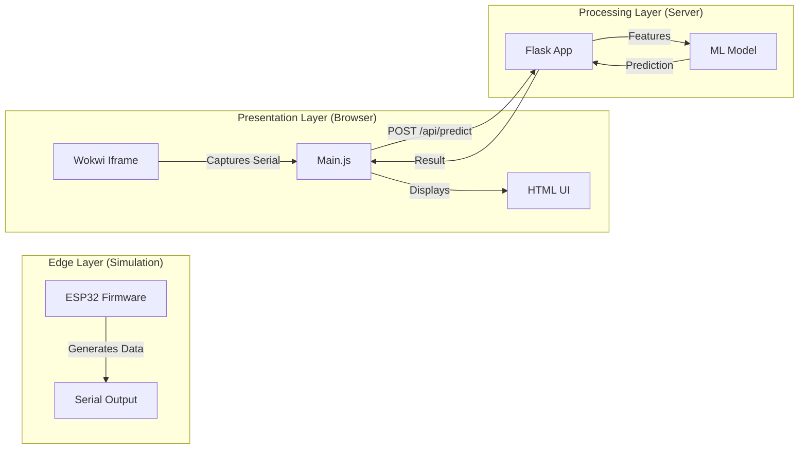

# 🌊 Water Quality Monitoring System - Project Workflow & Template

This document provides a comprehensive, step-by-step explanation of the entire project. It serves as a **Master Template** for building similar IoT + AI projects.

---

## 1. 🏗️ High-Level Architecture

The system is designed as a **Hybrid IoT-Web Application**. It bridges the gap between simulated hardware (Wokwi) and powerful backend processing (Python/ML).

### The "Big Picture"


---

## 2. 🔄 Detailed Data Flow (The "Life of a Packet")

Here is exactly what happens, millisecond by millisecond, when the system runs:

### Step 1: Data Generation (Firmware)
*   **Location**: `firmware/water_quality_monitor.ino`
*   **Action**: The `loop()` function runs every 2 seconds.
*   **Process**:
    1.  Reads simulated analog values from potentiometers (pH, Turbidity, etc.).
    2.  Maps these raw values (0-4095) to real-world units (e.g., pH 0-14).
    3.  Constructs a **JSON String**: `{"pH": 7.2, "Turbidity": 2.5, ...}`.
    4.  **Crucial Step**: Prints this JSON string to the Serial port using `Serial.println(json)`.

### Step 2: Data Capture (Frontend Bridge)
*   **Location**: `backend/static/js/main.js` (inside the browser)
*   **Action**: The browser hosts the Wokwi simulation in an `<iframe>`.
*   **Process**:
    1.  Wokwi emits a message event whenever the simulated ESP32 prints to Serial.
    2.  `main.js` listens for this event: `window.addEventListener('message', ...)`.
    3.  It filters for `type: 'wokwi:serial'`.
    4.  It parses the JSON string back into a JavaScript object.

### Step 3: Intelligence (Backend Processing)
*   **Location**: `backend/app.py`
*   **Action**: The frontend sends the data to the server for analysis.
*   **Process**:
    1.  `main.js` sends an HTTP POST request to `http://localhost:5000/api/predict` with the sensor data.
    2.  **Flask** receives the request.
    3.  It extracts the features: `[pH, Sulphate, Hardness, Conductivity, TDS, Turbidity]`.
    4.  It loads the trained Machine Learning model (`tamilnadu_water_model.joblib`).
    5.  **The Brain**: The model predicts if the water is **Safe (1)** or **Unsafe (0)**.
    6.  Flask calculates the **Confidence Score** (probability).

### Step 4: Feedback (User Interface)
*   **Location**: `backend/templates/index.html`
*   **Action**: The dashboard updates in real-time.
*   **Process**:
    1.  Flask sends the prediction back to `main.js`.
    2.  `main.js` updates the DOM elements:
        *   Changes the big status icon (🛡️ vs ⚠️).
        *   Updates the "Confidence" percentage.
        *   Updates the sensor cards (Green for safe range, Red for critical).
        *   Increments the "Total Samples" counter.

---

## 3. 📂 Project Structure Explained

This folder structure is designed for scalability and separation of concerns.

```text
Project_Root/
├── backend/                    # 🧠 THE BRAIN (Server & Logic)
│   ├── app.py                  # The Main Controller. Starts the web server.
│   ├── config.py               # Settings (Ports, API Keys, Thresholds).
│   ├── train_model.py          # The Teacher. Creates the ML model from data.
│   ├── tamilnadu_water_model.joblib # The Trained Brain (Binary file).
│   ├── requirements.txt        # List of ingredients (Python libraries).
│   ├── static/                 # Frontend Assets (CSS, JS, Images).
│   └── templates/              # HTML Pages (The User Interface).
│
├── firmware/                   # 🤖 THE BODY (Hardware Code)
│   ├── water_quality_monitor.ino # The C++ code running on the ESP32.
│   ├── diagram.json            # Wokwi wiring diagram (defines connections).
│   └── wokwi.toml              # Wokwi configuration file.
│
├── docs/                       # 📚 THE MANUAL
│   ├── PROJECT_WORKFLOW_TEMPLATE.md # This file.
│   └── ... (Guides & Setup)
│
└── run_project.bat             # 🚀 THE LAUNCHER (One-click start).
```

---

## 4. 🛠️ How to Replicate This (Template Guide)

Want to build a **"Smart Fire Alarm"** or **"Plant Monitor"**? Follow this recipe:

### Phase 1: Firmware (The Edge)
1.  Copy the `firmware/` folder.
2.  Edit `diagram.json` to add your sensors (e.g., DHT22 for Temp/Humidity).
3.  Edit `.ino` file:
    *   Update `readSensor()` logic for your new sensors.
    *   Ensure the JSON output matches your new data structure: `{"temp": 25, "humidity": 60}`.

### Phase 2: Intelligence (The Model)
1.  Edit `backend/train_model.py`.
2.  Update the `generate_synthetic_data()` function to create data relevant to your project (e.g., "High Temp + Low Humidity = Fire Risk").
3.  Run `python train_model.py` to generate a new `.joblib` model.

### Phase 3: The Backend
1.  Edit `backend/app.py`.
2.  Update the `predict()` function to accept your new JSON fields (`temp`, `humidity`).
3.  Ensure the feature order matches exactly what you used in training.

### Phase 4: The Frontend
1.  Edit `backend/templates/index.html`.
2.  Change the sensor cards to display "Temperature" and "Humidity" instead of pH/Turbidity.
3.  Update `backend/static/js/main.js` to map the incoming JSON keys to the new HTML IDs.

---

## 5. 💡 Key Technologies Used

*   **Wokwi**: For simulating hardware without buying components.
*   **Flask**: A lightweight Python web server.
*   **Scikit-Learn**: For creating the Random Forest ML model.
*   **Socket.IO / HTTP**: For real-time communication between layers.
*   **Mermaid.js**: For generating the diagrams in this document.

---

**🚀 Ready to Build?**
Use this structure as your foundation. Keep the "Firmware -> JSON -> Backend -> ML -> UI" loop intact, and you can build almost any IoT application!
